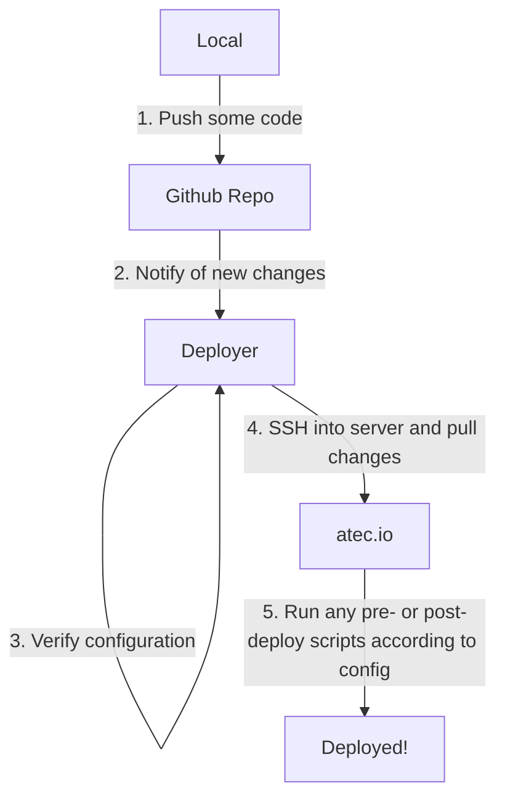

# The ArtSciLab Deployer 

The [ArtSciLab deployer](https://github.com/artscilab/deployer) is a utility created to automate deployments to our server.

The basic idea is that it receives a notification from GitHub via webhooks (details below) whenever there are new changes to a codebase. It then reads deployment configuration details from config.js and carries out the update accordingly. 

All details about all the different services are contained within config.js, which allows us to follow a centralized approach to this, and make/track changes to projects in one place.

 

# Configuring a new project
There are two ways to configure deployment: deploy using git pull or delete everything and then download and extract the latest archive from github. As you can imagine, the git pull way is preferred. 

If you'd like to register a project to use the automated deployer, follow the following steps: 

#### On the server
- Log onto the server and use `git clone` to get the project on there. Use a location like your home folder, or a webroot (if you need to make a new subdomain to host it from, refer to [adding a subdomain](/server/addSubdomain.md))

- Run whatever scripts to build it for the first time

- Use `chmod` and `chgrp` to assign the `www-data` group to that project and give read+write+execute permissions to the group.

  ?> A helpful enhancement to the deployer would be to make all the folders necessary on the server if it detects that a path doesn't exist. It would also need to reject the deployment and notify that the folder is non-empty with a different project. This means that a way to detect which project is deployed there would be needed.

#### On the deployer
- Edit `config.js` in the root of the deployer repo to reflect the new project and fill in the details. Look at existing projects and read the comments to help you. 

- ~~Go to the settings page of the repo you are setting up deployments for.~~

- ~~Click on the webhooks tab in the left menu, and then Add Webhook.~~ 

- ~~Paste in the following URL (correct as of the time of writing this wiki): (redacted).~~

- ~~Make sure `just the push event` is marked, and check the box to enable `SSL verification`. Leave `secret` empty.~~

- ~~Click on Add Webhook to finish up.~~

  ?> We now have the webhook set up as part of the Github Organization, so any project belonging to the ArtSciLab org will be sending requests to the deployer on [the `push` event](https://developer.github.com/webhooks/event-payloads/#push).

Now, every push to that repository will trigger the webhook. Github will sent a POST request to the deployer app at tha URL of the deployer. The deployer app will follow the logic in `index.js` to carry out deployment. 

# Implementation details
The deployer itself is deployed on the ArtSciLab Heroku (consult the ArtSci Heroku wiki page if it exists).

It expects as a Config Var a private key that enables it to ssh into the server as the `git` user. The `git` user is part of the `www-data` group. As such, locations on the server that the deployer needs access to should have read-write-execute permissions available to either `git` or `www-data`. 

---

Contributors: Al Madireddy